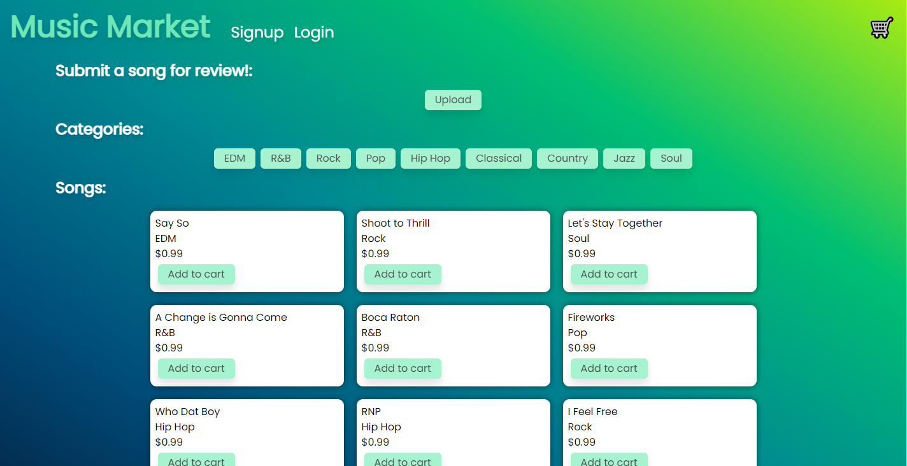
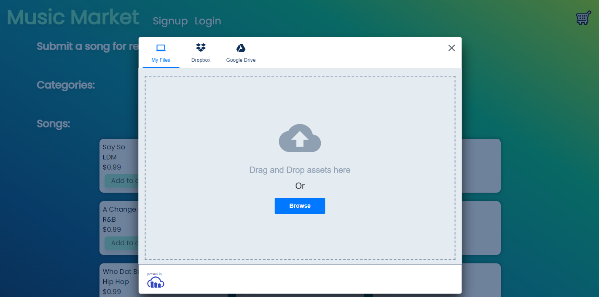
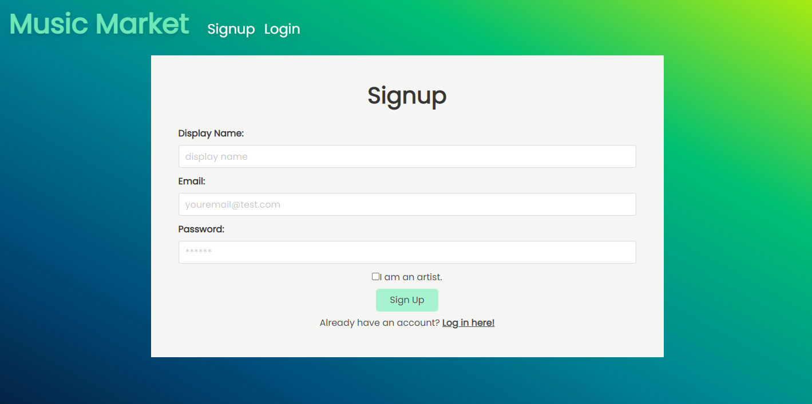
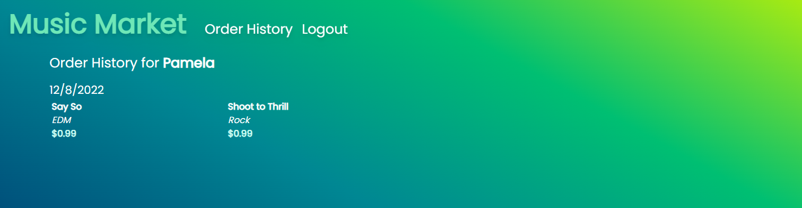
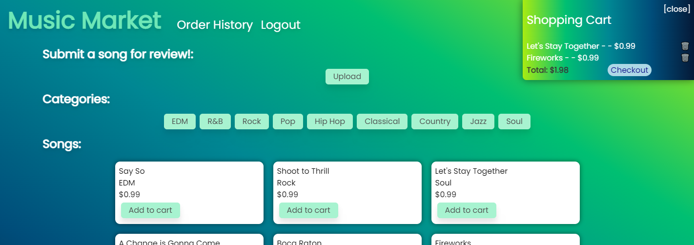
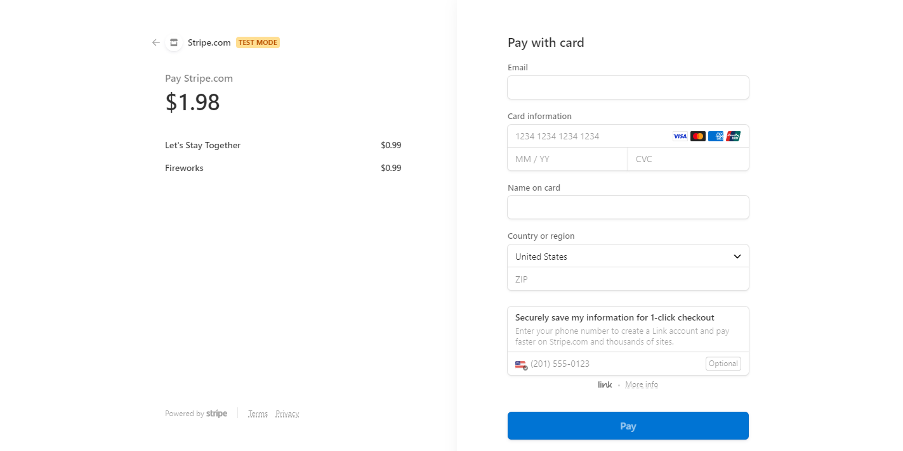

# Music Market

## Description

***[Click HERE to visit the deployed application!](https://g02-music-market.herokuapp.com/)***

**Music Market** is an online music store where artists can upload and sell their music where fans can discover and support them.

Our motivation for development was to practice e-commerce development skills while combining it with something we all love: music.

Technologies used:
* MERN stack
* Cloudinary for uploading audio files
* GraphQL
* Apollo Server
* Stripe for payments
* CSS: Tailwind and Bulma

### User Story

**AS A** music lover,
**I WANT** to upload my songs and browse other artists’ songs
**SO THAT** I can share my music and support other artists

## Table of Contents

* [Screenshots](#screenshots)
* [Questions](#questions)

## Screenshots

## Credit

Made with ❤ by [Jacob Canepa](https://github.com/jacobmcanepa), [Wilmer Martinez](), [Will Wartick](https://github.com/wwartick), and [Nikki Esguerra](https://github.com/desguerra)
